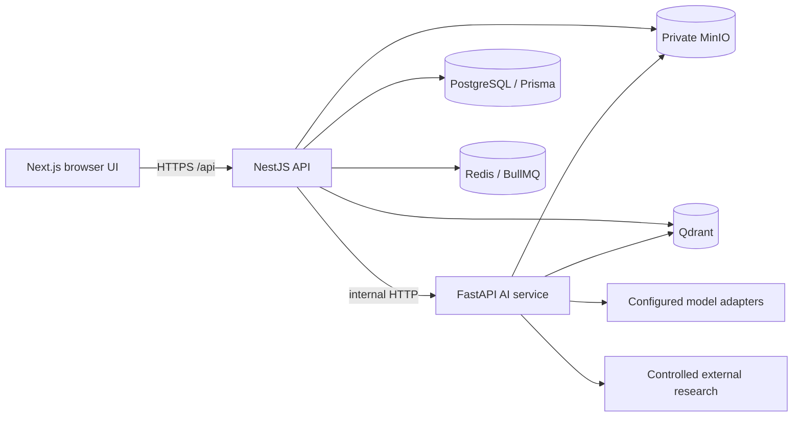

# Architecture Overview

The platform separates browser, API, AI, stateful infrastructure, and optional provider boundaries. The browser never receives provider credentials, raw database access, or arbitrary tool execution rights.

- Next.js owns interaction and calls only the NestJS API.
- NestJS owns authentication, project authorization, quotas, jobs, snapshots, exports, audit events, and provider policy handoff.
- FastAPI owns AI-facing contract validation, retrieval, bounded analysis graphs, controlled research, and model adapter execution.
- PostgreSQL stores authoritative transactional state. Redis/BullMQ carry work, MinIO stores private objects, and Qdrant stores retrieval vectors.
- Shared TypeScript contracts live in `packages/contracts`; Python Pydantic schemas mirror the service contract surface.

The phase design details and ADR decisions remain authoritative: [phases 1–11](.) and [ADRs](../adr). Phase 12 adds release controls only; it does not add a new product service.
