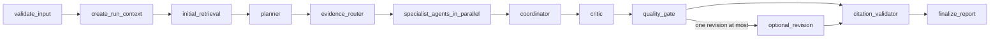

# Phase 5 Architecture

Phase 5 adds a bounded decision-analysis workflow. The browser calls NestJS only. NestJS authorizes project membership, validates the selected knowledge-base and document scope, writes immutable run metadata, and dispatches a BullMQ job. The worker invokes the internal FastAPI endpoint with the same scoped evidence returned by the existing Phase 4 retrieval pipeline.

`SINGLE_AGENT` shares the same authorized evidence, context cap, report contract, and citation validation, but has no specialists. `MULTI_AGENT` uses only the five server allowlisted specialists: market, financial, legal and regulatory, risk, and strategy.

The graph state contains bounded evidence and request metadata only. It never contains credentials, raw embeddings, document binaries, hidden reasoning, or tool definitions. Checkpoint metadata is persisted in PostgreSQL per immutable run and graph version; node and report writes use unique keys so BullMQ redelivery cannot duplicate them. A cancellation request is checked before and after the internal call.

No public web search, user-controlled tools, code execution, payment workflow, or long-term agent memory is introduced.
