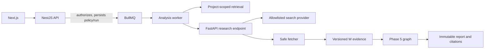

# Phase 6 Architecture

Phase 6 adds controlled external research and an experiment/evaluation surface to the bounded Phase 5 analysis workflow. It does not make browsing autonomous: a user selects `INTERNAL_ONLY`, `EXTERNAL_ONLY`, or `HYBRID`, and external research additionally requires both explicit request consent and the server-side `EXTERNAL_RESEARCH_ENABLED=true` switch.

NestJS remains the policy enforcement point. It validates public request contracts, project membership, bounded filters, cancellation, persistence, and exports. FastAPI owns only the server-controlled research plan, provider adapter, fetching, normalization, source scoring, and calculator. Provider credentials stay in service configuration and are never accepted from a browser request or included in graph state.

The fetcher permits HTTP(S) only, blocks credential-bearing URLs and private/loopback/link-local/reserved destinations, resolves DNS for every fetch and redirect, limits redirects, bytes, content types, and timeouts, sends no browser cookies or authorization, and stores extracted text rather than rendered HTML. Retrieved text is untrusted evidence; it is never executable instruction text.

Each external source has an immutable snapshot and normalized-content hash. External evidence receives stable `W1…` identifiers and is stored separately from internal `E1…` evidence. A final report records an `ExternalAnalysisCitation` with the source and snapshot. Failed or exhausted research completes with structured limitations where a usable report remains possible.

Experiments use project-scoped variants, cases, queued runs, metric records, and versioned human evaluation. The initial metric worker intentionally emits deterministic synthetic measurements, labelled `SYNTHETIC_EVALUATION`, so it is useful for wiring, UI, persistence, and reproducible smoke tests but is not represented as a production benchmark. A real evaluator or LLM judge remains disabled unless configured and separately validated.
