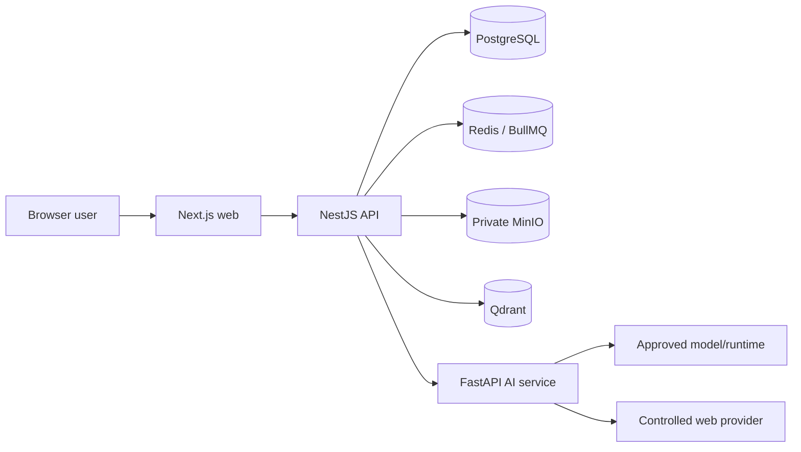

# Threat Model

## Assets and trust boundaries

| Threat                                  | Existing mitigation                                                                                                                | Residual risk / release action                                                                  |
| --------------------------------------- | ---------------------------------------------------------------------------------------------------------------------------------- | ----------------------------------------------------------------------------------------------- |
| Credential theft or exposure            | Docker secret-file support, environment validation, Pino redaction, safe health/version payloads, no browser provider credentials. | Rotate through the runbook; static scan and target-host controls still need evidence.           |
| Account/session abuse                   | Secure cookie settings in production, rate limits, refresh rotation, session revocation.                                           | Verify CSRF and browser flows in E2E.                                                           |
| Cross-project data access               | Project membership authorization, scoped storage keys, private object bucket, API authorization boundary.                          | Test IDOR and role changes before release.                                                      |
| Malicious documents or prompt injection | File limits/types, ingestion boundary, citation validation, prompt-injection filtering, bounded retrieval.                         | Development scanner limitation remains; production scanning requires fail-closed configuration. |
| SSRF and hostile web content            | Scheme/content limits, redirects/byte/time limits, private-network blocking, server-owned provider policy.                         | Re-run abuse tests after dependency updates.                                                    |
| Unsafe output/export/share exposure     | Immutable sanitized snapshots, private exports, hashed tokens, expiry/revocation, entitlement checks.                              | Recipient copy risk remains; sharing E2E is open.                                               |
| Queue replay/duplicate work             | Idempotency keys, durable state, job state handling.                                                                               | Worker-restart recovery drill is open.                                                          |
| Supply-chain compromise                 | Lockfiles, frozen installs, pinned runtime/base tags, CI checks.                                                                   | Final audit/SBOM/image digest scan are open.                                                    |
| Availability loss/data corruption       | Health checks, backups, forward-only migration policy, controlled recovery scripts.                                                | Clean migration and restore drills are release blockers.                                        |

This is an engineering threat model, not a formal security certification.
